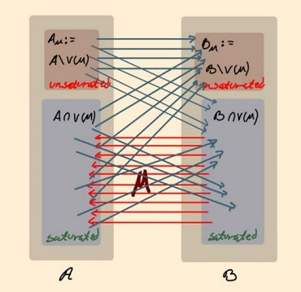

# Hungarian Algorithm for Maximum Matching in a Directed Unweighted Graph

This repository contains a Python implementation of the Hungarian algorithm for finding the maximum matching in a directed unweighted graph.  


## Table of Contents

- [Introduction](#introduction)
- [Usage](#usage)
- [Algorithm Overview](#algorithm-overview)
- [Example](#example)

## Introduction

The Hungarian algorithm, also known as the Kuhn-Munkres algorithm, is an efficient method for solving the maximum matching problem in bipartite graphs. It can find the maximum matching in a directed unweighted graph, where each edge represents a connection between two nodes.

This implementation provides a Python implementation of the Hungarian algorithm, allowing you to find the maximum matching in your own directed unweighted graphs.

## Usage

To use this implementation, follow these steps:

1. Clone the repository or download the source code.
2. Install the required dependencies by running 'pip install networkx' and 'pip install matplotlib'.
3. Construct your directed unweighted graph as an adjacency matrix or list of lists, where mat[i][j] is 0 or 1.
4. Construct your matching M so the algorithm will start from.
5. Note: the program assumes valid input so double check the adjacency matrix and starting matching
6. The program will show a sequence of figures that updates automatically every 2 seconds to show the process of the method of finding the maximum matching. The blue nodes and edges are currently not in the matching, the red nodes and edges are in the matching and the green edges are being augmented in the current iteration.

## Algorithm Overview

The Hungarian algorithm works by iteratively finding augmenting paths in the graph until no more augmenting paths can be found. An augmenting path is a path in the graph that starts and ends with unmatched nodes and alternates between matched and unmatched edges.

The algorithm uses a technique called "labeling" to assign labels to the nodes and reduce the problem to a series of assignment problems. It then uses the Hungarian method for solving these assignment problems to find augmenting paths and update the matching.

The time complexity of the Hungarian algorithm is O(n^3), where n is the number of nodes in the graph.

## Example

```python
...

# Construct the directed unweighted graph as an adjacency matrix
G = [
    [0, 1, 0, 0],
    [0, 0, 1, 0],
    [1, 0, 0, 1],
    [0, 0, 0, 1],
    [0, 1, 1, 0],
]

# Construct the matching as a list of tuples, note that all of the edges should be from 'Ai' to 'Bj' where i,j are numbers representing the node

M = [('A2','B1'),('A4','B2')]

...

```